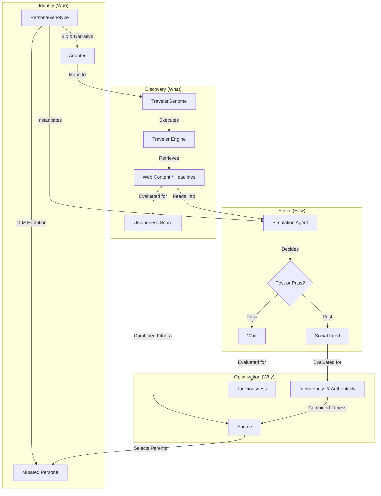

# System Architecture

SnackPersona simulates a closed-loop system where personality drives information consumption, and information consumption drives social output.

## High-Level Data Flow

## Module Breakdown

### 1. `snackPersona` (Core)
-   **Genotype**: `utils/data_models.py` defines the `PersonaGenotype` (Rich Bio).
-   **Evolution**: `orchestrator/engine.py` manages the generational loop using `LLMMutator` to rewrite bios.
-   **Evaluator**: `evaluation/evaluator.py` scores outputs for:
    -   **Incisiveness**: Blunt, conversation-stopping statements (Truth or Bold Lies).
    -   **Judiciousness**: Smart silence (knowing when to `PASS`).
    -   **Authenticity**: Avoiding resume-speak.

### 2. `snackPersona.traveler` (Discovery)
-   **TravelerGenome**: Defines *how* an agent searches (Source Bias, Query Templates, Depth).
-   **Fitness**: Evaluates search quality based on **Uniqueness** (finding niche content distinct from the population).
    -   *Note*: We deliberately do **not** filter for factuality ("Conclusiveness") to allow for diverse personas like Liars and Debunkers.

### 3. `snackPersona.llm` (Infrastructure)
-   **Client**: Abstract base class for LLM interactions.
-   **Factory**: Creates clients based on presets (`gemini-flash`).
-   **RateLimiter**: Prevents API throttling.
-   **No Mocks**: The system requires a real LLM backend for all operations.

### 4. `snackPersona.integration` (Glue)
-   **Adapter**: `adapter.py` uses an LLM to translate a textual Bio into structured Search Parameters (`TravelerGenome`).

## Key Concepts

### Bio-Driven Adaptation
Instead of manually configuring search settings, we use the LLM to "read" the persona's bio and infer their search habits.
-   *Input*: "I am a skeptical journalist..."
-   *Output*: `source_bias={"official": -0.5, "blogs": 0.8}, query_template="questioning"`

### Unified Evolution
The system optimizes for two things simultaneously:
1.  **Social Success**: Engagement, authenticity of voice, and impact (incisiveness).
2.  **Information Uniqueness**: Finding novel content that no one else found.

This encourages the emergence of diverse subcultures and specialist agents.
